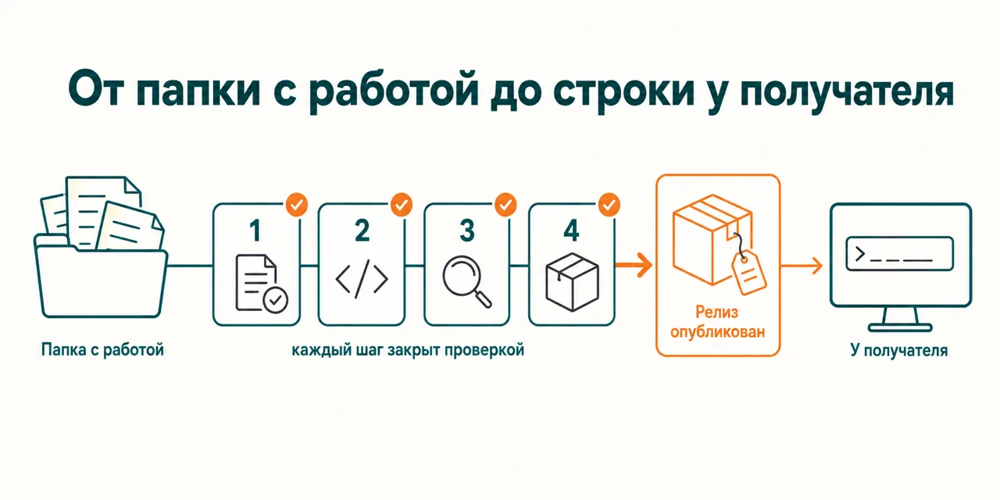
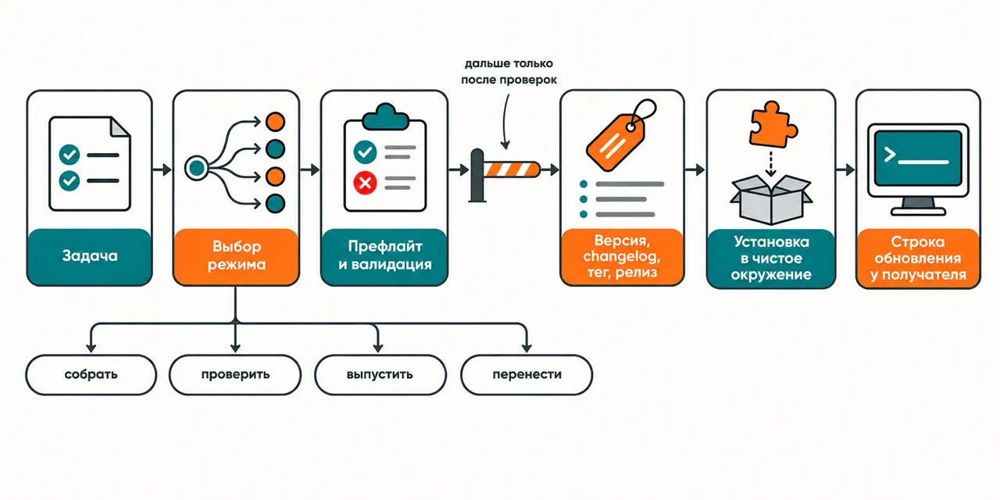

English · [Русский](README.md)

# The plugin updated on your machine, whoever installed it still runs the old version — and neither of you finds out

The release goes down a single list: offline preflight, `claude plugin validate --strict`, the
version in exactly one place, changelog, tag, release and an install into a clean environment — and
the recipient gets the line they have to run on their side.

```
claude plugin marketplace add https://github.com/beCyborg/jadlis-hub
claude plugin install jadlis-plugin-creator@jadlis
```

No keys are needed; what is needed is git, an authenticated `gh` and `claude plugin` itself — the
tag, the release and the verification install all rest on them.



In words: on the left a folder of finished work, on the right a published release, and between them
the steps, each closed by a check, with the last arrow leading to the person who already has the
plugin installed.

This is my workbench published as it is, not a product: whatever I stopped using, I removed.

## Before → after

| By hand | With an AI chat | With this plugin |
|---|---|---|
| **What actually reaches the recipient.** The edit is in, the commit is pushed — and the release counts as done. | It will explain how `plugin.json` is built, but it cannot see your tree and will not remind you that the version is the cache key. | The version is bumped in `plugin.json` and nowhere else: if it matches what is installed, the update silently skips the plugin — so the bump sits in the same step as the edit. |
| **Where the edits live.** The marketplace clone is right there, and editing straight inside it is the easiest route. | It does not tell the paths apart and will suggest editing wherever a file happens to be open. | Work happens in a separate dev clone, the branch is pushed immediately, and `claude plugin` operations run only after the push: the background refresh resets the marketplace clone to origin, local branches included. |
| **What "checked" means.** By eye across the JSON and the folder layout, as far as a look reaches. | It will say the schema looks right. | First the offline preflight for the house standard, then `claude plugin validate --strict` in every mode that fits the layout, then an install into a clean environment with a sentinel skill invoked: the validator is not the loader. |
| **How a version ships.** The steps run from memory, and a skipped one stays invisible until a recipient complains. | It will list the steps, but will not check that the tag was created and the release published. | The tag `{plugin-name}--v{version}` is made by `claude plugin tag --push`, which demands a clean tree and manifests that agree; the release goes on top of the tag via `gh`, and the update line is repeated in the release notes. |
| **Moving a legacy repo.** The consolidated marketplace exists, and people's installs stay pointed at the old one. | It will suggest renaming the plugin — and the installs break. | The plugin name stays put, a true rename goes through the append-only `renames` map, the old marketplace stays readable until recipients have moved, and plugins with a remote source are told about the reinstall in advance. |

## How it works



Going in — a folder of finished work, or a repo that is due for a release.
Inside — the route for the mode: a scaffold to the house standard, offline preflight and `claude
plugin validate --strict`, a version bump with the changelog, tag and release, a move into the
consolidated marketplace.
Coming out — a published release and the update line the recipient runs.

In words: task → mode picked (assemble, validate, release, migrate) → preflight and validation →
version, changelog, tag, release → install into a clean environment → update line on the recipient's
side.

One skill runs all of it, inline and with no subagents: git and `gh` operations are sequential and
depend on the state of the working tree. There are four modes — scaffold, validate, release, migrate
a legacy repo into the consolidated marketplace; on an ambiguous task the skill does not guess, it
asks one question with those four options. Facts about manifests, component types, marketplaces and
releases are not answered from memory: references sit next to the skill, and the mode opens the one
that matches the question. The offline preflight catches what the canon `claude plugin validate`
does not: the version declared in exactly one place, `$schema` in both manifests, LICENSE present,
`plugins[]` sorted and free of duplicates, every external source pinned to a full commit SHA,
`.mcp.json` and `hooks/hooks.json` parsing as JSON, the outer wrapper on hooks, and
`${CLAUDE_PLUGIN_ROOT}` quoted in shell-form commands. Findings come back as a list split into
errors and warnings, with the fix on each one.

## Installing and the first run

**a) Text to paste to an agent.** Copy the whole thing into a Claude Code chat:

```
You are the installer. Install the plugin jadlis-plugin-creator from the jadlis marketplace on this Mac.
Run exactly these commands, verbatim, shortening nothing:
1. claude plugin marketplace add https://github.com/beCyborg/jadlis-hub
2. claude plugin install jadlis-plugin-creator@jadlis
3. claude plugin list — show me the line about jadlis-plugin-creator and its version.
This plugin asks for no keys. Check separately and tell me whether this machine has git,
python3 and an authenticated gh (gh auth status): without them the tag, release and
verification-install steps will not go through.
Before each command show it to me in full and wait for "yes". If I say "no", do not run it,
tell me what you skipped, and move on.
If a command returns an error, stop, show me the output, and do not move to the next one.
```

**b) Commands by hand.**

```
claude plugin marketplace add https://github.com/beCyborg/jadlis-hub
claude plugin install jadlis-plugin-creator@jadlis
claude plugin list
```

The first command installs nothing — it adds the marketplace. Only the second one installs, and one
line removes it: `claude plugin uninstall jadlis-plugin-creator@jadlis --keep-data`.

**c) The short command.** Open Claude Code in the dev clone of your repo and type:

```
/plugin-creator <your task>
```

For example: `/plugin-creator validate the plugin before release`. If it is not found, check the
name with `claude plugin list`. Do not run it inside the marketplace clone under
`~/.claude/plugins/marketplaces/`: the background refresh wipes edits there.

## Limits, cost, updating

**What it does not do.** It does not write or improve the content of a skill — the interview, the
architecture, the evals and the description tuning live in `skill-builder`; here you get the
packaging and the release of work that is already finished. It does not submit a plugin to
Anthropic's official and community catalogs: those go through their web forms. It does not walk you
through the marketplace UI — that is the official documentation. It does not fix findings on its
own: it hands you the list with the fix on each one and edits only when asked. And it does not
replace the live install — a green validator does not mean the plugin loads, which is why an install
into a clean environment is a step of its own.

**What you need.** No keys and no paid services: it runs on the Claude Code subscription. Externally
you need git, an authenticated `gh`, `claude plugin` itself and python3 for the offline preflight —
without them the tag, the release and the verification install do not go through. You also need a
separate dev clone of the repo: edits inside `~/.claude/plugins/marketplaces/<name>/` are wiped by
the background refresh, local branches with them.

[уточнить] — the repository pins no minimum versions for git, `gh` or python3.

**How tokens get spent.** A run is light: one skill, inline, no subagents and no MCP servers. The
references are read one at a time — the one that matches the question, not all of them. The
verification install costs more than the rest: it starts a separate session against a clean config
and invokes a sentinel skill there.

**Verified where I work:** my Mac, my subscription, my repositories. Where else this works —
[уточнить].

**Terms of use.** Licensed under Apache-2.0 — the text is in the [LICENSE](LICENSE) file.

**Updating.** With a third-party marketplace, auto-update is off on your side: until you run the
first command you keep the version you installed.

```
claude plugin marketplace update jadlis
claude plugin update jadlis-plugin-creator@jadlis
claude plugin list
```

Reinstall, if something ended up crooked:

```
claude plugin uninstall jadlis-plugin-creator@jadlis --keep-data && claude plugin install jadlis-plugin-creator@jadlis
```
